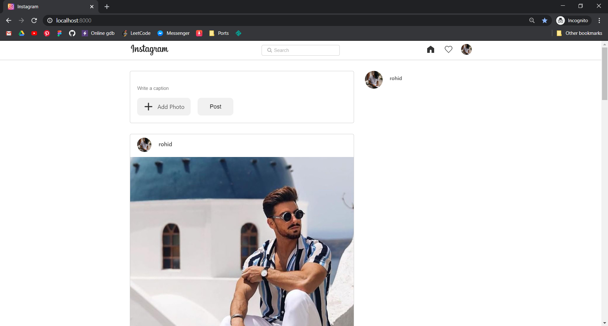
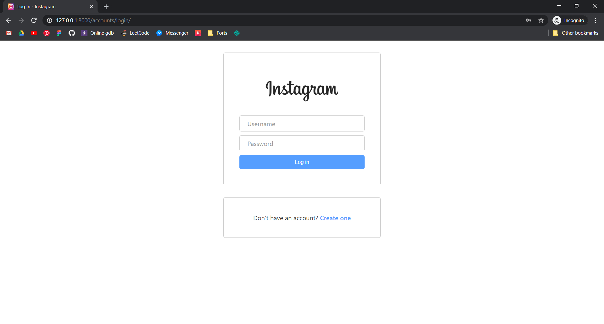

<p align="center">

  <h1 align="center">Instagram Clone</h1>

  <p align="center">
    Instagram clone project with django
    <br />
    <br />
    <a href="https://github.com/rohid-hub/Instagram_Clone/issues">Report Bug</a>
    ·
    <a href="https://github.com/rohid-hub/Instagram_Clone/issues">Request Feature</a>
  </p>
</p>


<!-- TABLE OF CONTENTS -->
## Table of Contents

* [About the Project](#about-the-project)
  * [Built With](#built-with)
* [Getting Started](#getting-started)
  * [Pre Requirments](#pre-requirements)
  * [Installation](#installation)
* [Contact](#contact)


<!-- ABOUT THE PROJECT -->
## About The Project

<p align="center"><p>

This is a instagram clone made with django a python backend framework. Django is on of the best framework for backend.

### Built With
It is build with
##### FrameWorks
* Django
##### Languages
* Python
* JavaScript
* HTML
* CSS/SCSS


<!-- GETTING STARTED -->
## Getting Started

Here's how you can use this project

### Pre Requirements

Pre requirements are
* git
* python3
* pip3(linux/mac)/pip(windows)

### Installation

1. First clone the repo
```sh
git clone git@github.com:rohid-hub/Instagram_Clone.git
```
3. Create Virtualenv
```sh
virtualenv env
```
Activating prosses for windows (cmd/ps)
```cmd
env/Scripts/activate
```
Activating prosses for mac or linux (bash)
```sh
source env/bin/activate
```
4. Now install the requirments.txt (pip for cmd/ps and pip3 for bash)
```cmd
pip3 install -r requirments.txt
```
5. Move to main django root dir where manage.py lives
```sh
cd instagram
```
5. Migrations
```sh
python manage.py makemigrations
pyhthon manage.py migrate
```
5. Create a super user for django admin panel. You can use this user as a instagram user in future as well.
```sh
python manage.py createsuperuser
```
It will ask you for a user name, email and password. Give this things to create super user

6. Run the server
```sh
python manage.py runserver
```
It will open a server at port 8000. Go to your browser and go to 
[localhost:8000](localhost:8000/)

You should see this page.

7. Log in with the super user
  to log in give that username and password that you gave for creating superuser then click login. You should log in at this time. If not then try to go to the home page useing just localhost:8000/


  You should see this page bt in your their should not be any images!
  <br>
  <br>
  Thats it now you can upload images and create new user and see eachothers posts in the timeline.

<!-- CONTACT -->
## Contact

Rohidul Islam - [email](rohidul677@gmail.com)

Github Link: [rohid-hub](https://github.com/rohid-hub)
